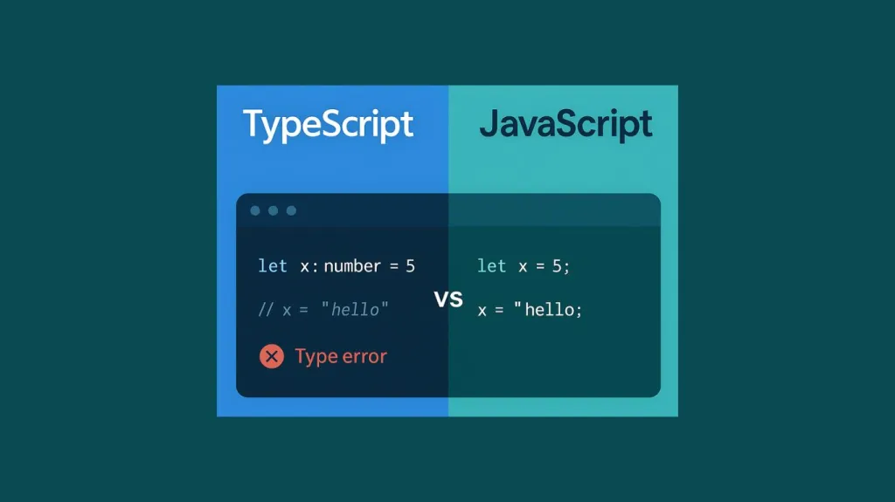

## Introduction

Are coding standards really about spaces and curly braces, or do they define what makes a piece of code good?
These are the types of questions software engineers should be asking themselves daily when creating constant lines of code.
Coding standards are essentially a set of rules or guidelines that define how code should be written and structured. Usually 
this helps a lot when working within a team of developers as it keeps the code clean and organized. However, everyone has preferences and sometimes
those preferences ignore the usage of such standards or rules. Depending on who you work for, some companies require these standards that can often seem very strict
and as a result could lead to future issues with your employer. Through my many experiences developing code, I believe coding standards can be essential for improving code, 
but should not be enforced for everyone. 

## Define Coding Standards 

Coding standards are more than just superficial style rules, they make it clear and precise to what is being presented. Simply adding comments 
or correctly using indentations allows for clear and easily understandable code. The bonuses to having certain coding standards is that it allows for more 
readability, maintainability, debugging ease, and collaboration in teams. Software engineers most times underestimate how standards impact their code. They do 
not realize that having such a foundation allows for much more ease when it comes to building projects. Even with the perks of coding standards however, I believe 
I am still on the contrary of if it should be used.

## My Stance on Coding Standards 

With using multiple languages and difference IDE's, I have realized there are so many different ways to code. Everyone enjoys a specific language or another, and the same
can be said for the way that their code is represented. I for example like to keep my code neat and tidy, while also keeping it casual. For example, I still use plenty of indentations, 
comments, and normal standards that were enforced into my brain when I first began. However there are certain ways to go about these standards, as I myself don't follow them all the time.
I understand the benefits of how it can contribute to learning a new language or helps avoiding bugs, but it gets to a point sometimes where it is excessive in its standards. For example, 
I used to use JGrasp, an IDE platform for Java, in which it was required all the time for your code to pass a checkstyle before it could used. The checkstyle would report any violations of 
defined coding standards in the compile messages tab, which would show all the little error mistakes that doesn't break your code, but makes it sound like its messy. I did not like nor appreciate
this level of standardization as it was frustrating to have a working API that would run and compile, but be left with tens of hundreds of checkstyle errors of small things like indentation in a 
specific place. 

## ESLint Experience 

My experience with ESLint has resulted in me disliking it mainly, as it is a similar situation to the previously mentioned checkstyle experience. The constant checking of small coding standards becomes
an annoyance very often to me, and while I understand its usage I don't find it fitting for my way of coding. The way ESLint works feels very strict and more annoying than useful overall. I do notice the mistakes 
I inputed when I see them listed, but nine times out of ten they are small mistakes that don't cause any sort've bug error. I found for me that ESLint isn't something I plan on using in my future of programming beyond this class, 
however it is useful to know incase I do need to follow certain coding standards for a specific company.

## Conclusion 

While I have been coding for over a couple years now, I still believe that coding standards can be both beneficial but also annoying for myself. I understand the discipline and long-term benefits that they provide when it comes
to programming, however for much costly time it consumes for it to show small mistakes, I don't believe it is worth my time when it comes to smaller tasks. Adopting coding standards I believe are something that you should be aware of 
and have knowledge of, however I don't see it being useful for me to evolve as a better programmer. 
