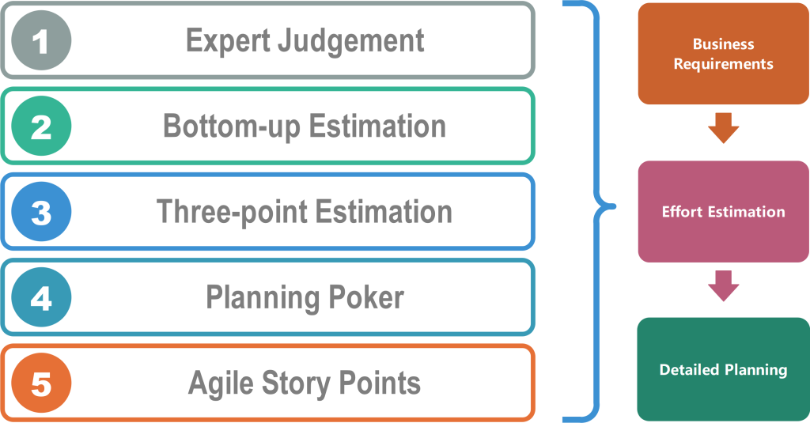

## How I Estimated Effort

When starting the RateMyTools project, estimating effort for each issue was honestly difficult because I didn't have much historical data to go off of. For Milestone 1, I based my estimates on previous ICS coursework and personal projects. For UI tasks, I estimated based on how complex the page seemed and how many components were needed. For technical tasks like NextAuth.js authentication, I researched similar implementations and estimated based on documentation reading time plus actual coding.

As we moved into Milestones 2 and 3, my estimates improved because I could use actual effort data from M1. I started comparing similar tasks across milestones and accounting for debugging time since our team had already dealt with Vercel deployment challenges. For Issue #27 (Connect Rate Page to Backend), I estimated 90 minutes because I had just finished similar database integration work. I split it into 60 minutes for coding and 30 for testing, which ended up being pretty accurate. 

## Benefits of Estimating in Advance

Even though my estimates were often wrong, estimating in advance helped me break down each issue into smaller pieces before starting. This helped identify dependencies early - like realizing we needed database architecture completed before connecting pages to the backend. The estimates also helped our team balance workload across milestones, seeing which issues were quick wins versus time-intensive tasks.

Having an estimate gave me a psychological target to work toward. When I went way over my estimate, it was usually a sign I was stuck and needed to ask for help or take a different approach. The process forced me to think through the work before diving in, which made me more prepared when I actually started coding.

## Tracking Actual Effort

Tracking actual effort turned out to be valuable for improving future estimates. After M1, I noticed I consistently underestimated non-coding effort - things like researching documentation, debugging, and planning took way more time than expected. For M2 and M3, I added more buffer time for these activities, making my estimates more realistic.

For coding effort, I used manual tracking with a timer whenever I worked in VSCode. For non-coding effort, I kept a spreadsheet logging start and stop times for activities like reading documentation, team discussions, and testing. My tracking was probably 75-80% accurate - I was consistent with coding sessions but sometimes forgot to log short research sessions. The biggest challenge was context switching between issues, which made it hard to attribute time precisely.

I learned that tasks involving new technologies took about 40-50% longer than familiar ones. Database work always needed more debugging time than UI work. These patterns helped me estimate better as the project progressed.

## AI Tool Usage

Throughout the project, I used GitHub Copilot for code completion, boilerplate generation, and debugging assistance. It was especially helpful for repetitive code like form validation and basic database queries.

For example, when setting up the Prisma schema, I prompted Copilot to create a Tool model with relationships to Reviews. The generated schema was about 80% correct - I had to adjust some field types and constraints. For Issue #27, Copilot generated a basic API route structure in seconds, but I spent about 25 minutes reviewing, testing, and debugging to make it work with our specific database setup.

Across all milestones, my AI-assisted time broke down roughly as: 45 minutes prompt engineering, 15 minutes generation, and 90 minutes verification and debugging. About 20% of AI-generated code worked as-is, 45% needed minor edits, 25% required major refactoring, and 10% I rewrote manually.

Using AI changed my estimates - simple CRUD operations took about 40% less time with Copilot. However, complex business logic didn't speed up much because those tasks still require human understanding. The challenge was that AI-generated code required way more verification time than I initially estimated. I learned to always plan significant time for reviewing and testing AI outputs.

## What I Would Change

Next time, I would create a checklist of effort categories before estimating: research time, coding time, testing time, debugging buffer, and integration time. For tracking, I would set up automatic reminders to log non-coding effort and use more granular categories in my spreadsheet beyond just "non-coding effort."

The biggest lessons I learned are: always add 25-50% buffer for integration and debugging, non-coding effort often equals coding effort, and tasks with new technology take about 2x longer than familiar technology. This experience taught me that software development is way more than just writing code - all the time spent reading documentation, debugging, and testing is real work that needs to be accounted for.

## Conclusion

Going through effort estimation for RateMyTools taught me that estimation isn't about being perfectly accurate - it's about understanding the work before you start. The most valuable insight was realizing how much time goes into non-coding activities. Before this project, I probably would have estimated just coding time and forgotten everything else.

Looking ahead, these practices will be valuable whether I'm working on personal projects, internships, or eventually a full-time job. Knowing how to break down tasks, estimate effort, and track progress helps me understand my own development process and continuously improve. The experience with AI tools also gave me a realistic perspective - they're powerful for certain tasks but not magic solutions that eliminate the need for human understanding. This assignment forced me to be more thoughtful about how I work, and that kind of self-awareness is exactly what separates good developers from great ones.
