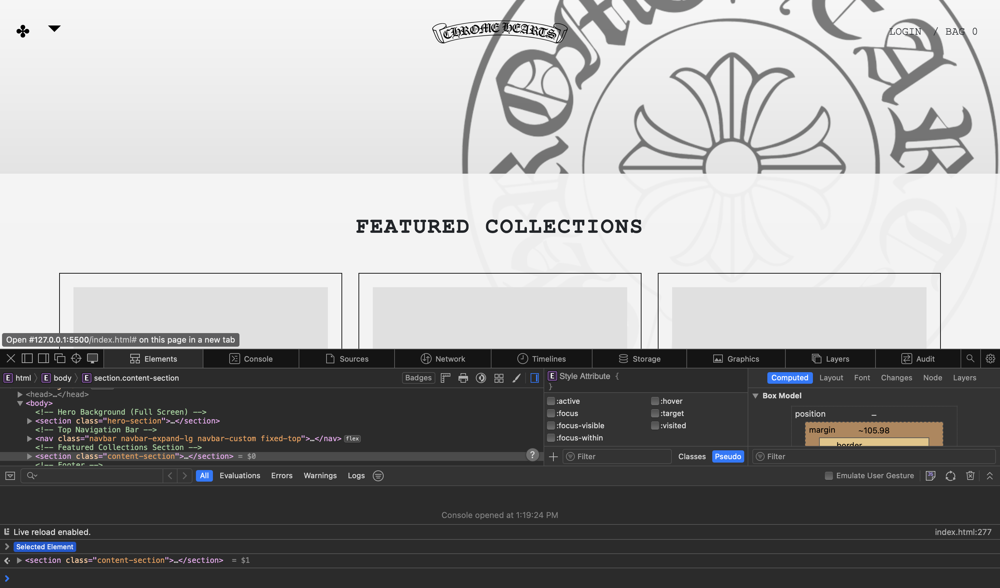

## Introduction

Building a modern website from scratch using only raw HTML and CSS is a little like building a house with just hand tools. It is definitely possible, but slow, frustrating, and overall not accepted by most people. When exploring 
these UI frameworks, I often found myself constantly enjoying the simplicity and display of cookie cutter 
designs.  UI Frameworks are essentially a collection of reusable design components within code, that are configured 
to be easy templates to work off of. One we have been using recently is Bootstrap5, which is a free open-source framework that simplifies the process of creating visually appealing and functional web interfaces. Frameworks can
be hard to learn, almost like learning a new language, but they exist for a reason. While UI frameworks come with a learning curve, they offer advantages in speed, consistency, scalability that outweigh the initial frustrations. 

## Why not use raw HTML and CSS?

HTML and CSS are very powerful, as they are the foundation to building these incredible websites we see and use 
everyday. However, they become tedious when it comes to modern needs. With raw coding HTML and CSS, you have to create layouts that adapt to not just your computer browser, but also your mobile devices and tablets. Not only this 
but developers often try to reinvent the wheel, but writing navbars like we had previously done, and create a buttons over and over. Even when you complete the creation of raw coding a website, there are many browser quirks as they all render differently. Without a template like Bootstrap5, it would take a lot more time to simply create 
responsive navigation menu. There are so many repetitive issues that come with coding raw with HTML, which is why frameworks like Bootstrap were created.

## What UI Frameworks Provide 

Frameworks offer so much more than just being a template, as they are basically toolkits. Pre-designed, tested, and 
optimized so you can reuse without creating something brand new. Within this class we have been using Bootstrap5, which 
comes with many awesome features. For example, Bootstrap5 allows the user to already have a grid system, which allows for your website to automatically adjust for screensize. Bootstrap5 also includes navbars, modals, cards, and bottons. It even has spacing, colors, and alignment without writing custom CSS! The benefits of frameworks allow
for accessibility that are already built in, visual consistency across pages, and easy documentation and large
community support. When I use Bootstrap5, I create a much more professional looking page in hours rather than one that would take days to develop. 

## Why Frameworks Matter in Software Engineering 

Even beyond individual projects, frameworks are valuable for teams and companies. They allow for much faster collaboration in which all developers on a project use the same system. Frameworks also allow for easier code maintainability, and are tested at scale and can handle projects from simple websites to huge apps. Frameworks help software engineers focus on functionality instead of reinventing CSS basics. While it shouldn't replace HTML and CSS, I believe it amplifies it, freeing developers to innovate faster and easier than ever. 

