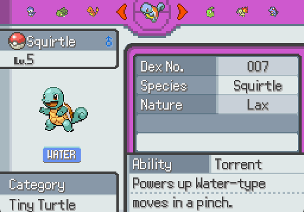

For the first couple of ICS classes, we began with Java, which is a more specific code than the others. Rather than simply typing print like Python, you have to type out "System.out.println('____')";. This sort've made me dread doing Java as it has so much extra fluff to it. As we progressed throughout the class and nearing the end, we each had to prepare a personal project of which we can choose. I personally had been getting back into Pokemon then so I used it as my idea for what to code up. The Pokedex was specifically designed for the user to choose from a list of many different Pokemon, adding them to your team. Unfortunatly with a strict deadline I did not have time to add additional features such as battling, catching wild ones or other things shown within the show and game. 

During this project I had to focus on a lot of OOP, or Object Oriented Programming, as well as UI interfaces to create a GUI, or a Graphical User Interface, that would benefit the user. Through OOP, I designed many lines of code, many of which was being reused, and made my code very clear so be easy to modify and debug. For the GUI I simply just had a list of Pokemon, your team, and a picture of Pokemon on the top. Unfortunely with Laulima being gone, as well as me also not having Github yet during this early time of my coding career, I never saved the project I am describing. However what I can say is that ultimately it taught me a lot about OOP's and how to properly build a user interface from the ground up. 

