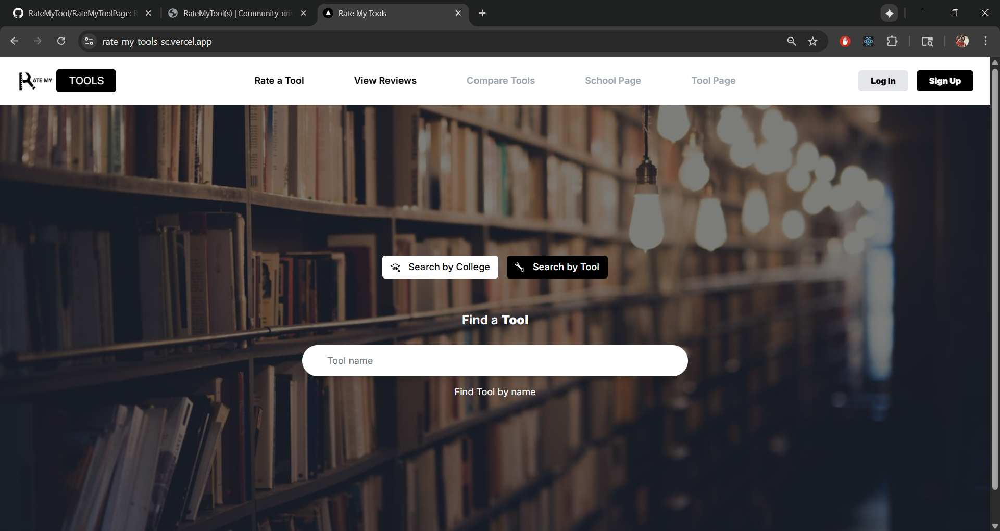
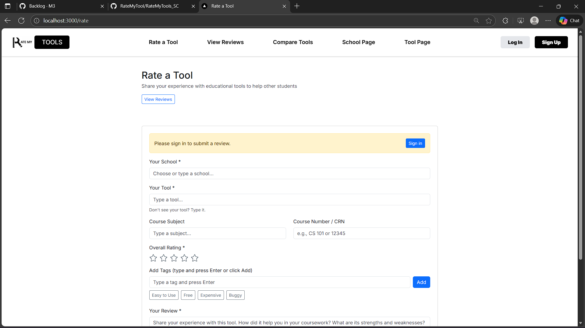
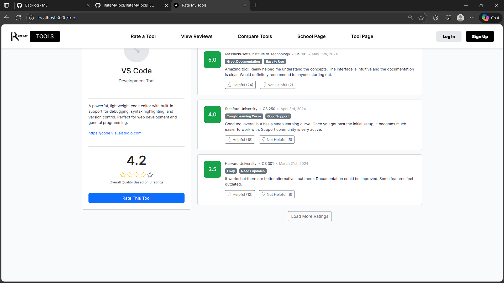

## Project Overview

RateMyTools is a community-driven review platform designed specifically for University of Hawaii students to rate and discover educational tools like Canvas, GitHub, VS Code, and more. The application allows students to share their experiences with various tools, helping future students make informed decisions about which platforms will best support their academic success.

The platform features school-specific tool recommendations, advanced search capabilities, tool comparison functionality, and AI-powered content moderation to maintain a safe and constructive community environment.

**Live Site:** [https://rate-my-tools-sc.vercel.app](https://rate-my-tools-sc.vercel.app)  
**GitHub Repository:** [https://github.com/kadekomeya/RateMyTools_SC](https://github.com/kadekomeya/RateMyTools_SC)

## My Contributions

As a core developer on this project, I was responsible for several critical features:

### Authentication System
- Implemented NextAuth.js authentication with email/password functionality
- Created user role management system (USER/ADMIN)
- Developed protected routes and authorization middleware
- Built admin dashboard capabilities for content moderation

### Search & Discovery Features
- Designed and implemented dynamic search functionality with real-time dropdown results
- Built school-specific tool pages showing aggregated ratings and reviews
- Created tool comparison page allowing users to find similar tools based on matching tags
- Developed responsive navigation with mobile hamburger menu

### Database Architecture
- Designed PostgreSQL database schema using Prisma ORM
- Implemented vote system for helpful/not helpful review ratings
- Created efficient data aggregation for tool ratings and statistics
- Managed database migrations and team synchronization

### AI Content Moderation
- Integrated OpenAI's moderation API to automatically flag inappropriate content
- Built three-tier moderation system (APPROVED, PENDING, REJECTED)
- Implemented admin review workflow for flagged content
- Created moderation logging system for audit trails

### UI/UX Enhancements
- Developed consistent yellow emoji voting system across all review displays
- Implemented pagination with URL state management for seamless navigation
- Added light gray backgrounds and card shadows for improved visual hierarchy
- Created responsive design supporting mobile, tablet, and desktop viewports

## Technical Challenges & Solutions

One of the biggest challenges was managing team synchronization when multiple developers were working with different database instances. Initially, team members were seeing different reviews because each person had configured their own separate Neon PostgreSQL database. I resolved this by:

1. Identifying the root cause (different `DATABASE_URL` values in `.env.local`)
2. Coordinating with the team to share a single database connection
3. Documenting the proper setup process for new team members
4. Creating a troubleshooting guide for common Prisma client issues

Another significant challenge was implementing the content moderation system. The initial implementation was blocking review creation entirely, when it should have been allowing reviews to be created with a "PENDING" status. I debugged this by:

1. Adding comprehensive logging to track moderation flow
2. Updating API responses to inform users when their reviews were flagged
3. Filtering out pending/rejected reviews from public-facing endpoints
4. Creating clear user feedback messages explaining moderation decisions

## What I Learned

This project significantly expanded my full-stack development skills:

**Backend Development:**
- Gained hands-on experience with Next.js API routes and server-side rendering
- Learned to design efficient database schemas and write complex Prisma queries
- Understood the importance of proper environment variable management
- Mastered JWT token handling with NextAuth.js

**Frontend Development:**
- Developed proficiency in React hooks (useState, useEffect, useMemo)
- Learned to manage complex client-side state and navigation
- Implemented responsive design patterns using Tailwind CSS and Bootstrap
- Created reusable component architecture

**Team Collaboration:**
- Practiced Agile methodology with sprint planning and issue tracking
- Used Git workflows with feature branches and pull requests
- Learned to resolve merge conflicts and coordinate concurrent development
- Improved technical communication through code reviews

**DevOps & Deployment:**
- Set up CI/CD pipelines with GitHub Actions
- Configured Vercel deployment with environment variables
- Debugged build errors and optimized production builds
- Managed database migrations in production environment

**AI Integration:**
- Integrated third-party APIs (OpenAI) into production applications
- Implemented error handling for external service failures
- Designed fallback mechanisms for API rate limits
- Balanced automated moderation with human oversight

## Key Features

- **User Authentication:** Secure sign-up/login with session management
- **School-Based Discovery:** Browse tools specific to your university
- **Advanced Search:** Real-time search with intelligent filtering
- **Review System:** Rate tools 1-5 stars with detailed text reviews
- **Voting Mechanism:** Upvote/downvote helpful reviews
- **Tool Comparison:** Find similar tools based on shared characteristics
- **Admin Dashboard:** Moderate flagged content and manage users
- **AI Moderation:** Automatic content filtering using OpenAI
- **Responsive Design:** Optimized for all device sizes

## Screenshots

  
  
  

## Reflection

Working on RateMyTools taught me that software engineering extends far beyond just writing code. It requires careful planning, clear communication, and systematic problem-solving. When we encountered the database synchronization issue, I learned the importance of documenting setup procedures and creating reproducible development environments.

The content moderation feature challenged me to think about user experience from both technical and ethical perspectives. Simply blocking "bad" content isn't enough—users deserve clear feedback about why their content was flagged and how to improve it. This experience taught me to design systems that are both effective and user-friendly.

Most importantly, this project reinforced that the best solutions often come from collaboration. When stuck on the compare page routing conflict, discussing the problem with teammates led us to identify the duplicate route folders. Regular code reviews and pair programming sessions helped us maintain code quality and catch bugs early.

This project has prepared me well for professional software development, giving me practical experience with modern web technologies, team collaboration tools, and the complete software development lifecycle from planning to deployment.

**Project Team:** Joseph Creollo, [Teammate Names]  
**Course:** ICS 314 - Software Engineering, Fall 2024  
**Organization:** [https://github.com/kadekomeya/RateMyTools_SC](https://github.com/kadekomeya/RateMyTools_SC)
